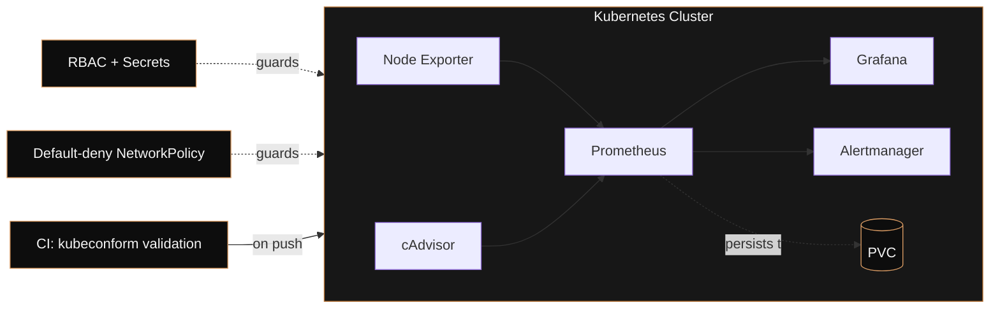

<h3>Software Engineer — Systems, Cloud & Reliability</h3>

 

I build software, then go find out how it actually runs in production — which is how Linux, containers, and Kubernetes ended up permanently in my stack. I'd rather ship three systems I understand end-to-end than ten I've only glued together.

 

## Featured engineering

### Kubernetes Monitoring Platform

Most monitoring setups stop at `docker-compose up`. This one is built to answer a harder question: *what does it take to run observability safely inside a cluster, not just visibly?*

It started as a Docker Compose stack — Prometheus, Grafana, and Node Exporter, version-pinned, with credentials externalized rather than hardcoded. Once the scrape targets were verified and the dashboards were auto-provisioning correctly, I migrated it onto Kubernetes and treated security as part of the design, not an afterthought bolted on at the end:

- **RBAC + Secrets** — scoped service accounts instead of default-namespace access
- **Default-deny NetworkPolicy** — with explicit egress/ingress rules carved out for Prometheus specifically, rather than one blanket allow rule
- **Persistent storage** — PVCs so metrics survive pod restarts
- **CI validation** — every manifest is checked with `kubeconform` before it can merge

`Kubernetes` `Docker` `Prometheus` `Grafana` `Alertmanager` `RBAC` `NetworkPolicies` `CI/CD`

<!-- Replace the line below with your actual repo URL -->
**[→ View repository](https://github.com/ItzMeBeasT/REPLACE-WITH-REPO-NAME)**

 

## Other builds

| Project | Engineering angle |
|---|---|
| **AI Incident Copilot** | Built and shipped inside a 36-hour hackathon window with a deliberately locked scope — the constraint was time, and the deliverable had to work, not be exhaustive. |
| **Cloud Computing Internship (Corizo)** | Hands-on AWS fundamentals — IAM, storage, hosting — through to a working static site deployed on S3. |
| **Gemini LifeOS** | An AI-assisted app that turns daily reflection into structured next steps, built for the Personal Gemini Journal challenge. |

 

## What I work with

**Languages & foundations** — Java, Python, Bash, and ongoing DSA practice

**Systems & cloud** — Linux (Fedora, daily driver), AWS, Docker, Kubernetes

**Observability & automation** — Prometheus, Grafana, GitHub Actions

**Data & networking** — MySQL, Cisco networking fundamentals

 

## Current focus

Software engineering fundamentals (Java, DSA) running in parallel with infrastructure depth — Linux administration first, then cloud architecture, then networking and Kubernetes administration.

| Certification | Area | Status |
|---|---|---|
| RHCSA | Linux administration | In progress |
| AWS Solutions Architect Associate | Cloud architecture | Planned |
| CCNA | Networking | Planned |
| CKA | Kubernetes administration | Planned |

 

## Activity

<!-- Uncomment once the snake.yml workflow has run at least once and the `output` branch exists -->
<!--  -->

 

  

