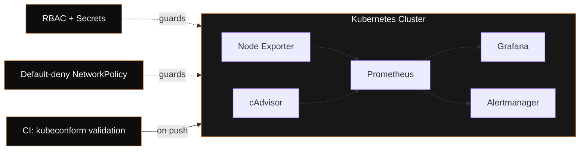

<div align="center">


<a href="https://readme-typing-svg.demolab.com">
  
</a>

<br/>

<a href="https://www.linkedin.com/in/regan-jesuraju/"></a>
<a href="https://medium.com/@regannbis"></a>
<a href="mailto:regannbis@gmail.com"></a>

</div>

<br/>

## Currently

```
> role       Computer Engineering student, targeting Cloud/DevOps SDE roles
> building   Kubernetes monitoring platform — Prometheus · Grafana · Alertmanager · RBAC
> roadmap    RHCSA  →  AWS Solutions Architect Associate  →  CCNA  →  CKA
> approach   3 flagship projects, done properly — not 10 done shallow
```

<br/>

## Flagship — Kubernetes Monitoring Platform

A self-hosted observability stack, secured the way a production cluster actually would be: least-privilege RBAC, default-deny NetworkPolicies with explicit egress/ingress rules, and manifest validation on every push.



`Kubernetes` `Docker` `Prometheus` `Grafana` `Alertmanager` `RBAC` `NetworkPolicies` `CI/CD`

**[→ View repository](https://github.com/ItzMeBeasT/REPLACE-WITH-REPO-NAME)** — swap in your actual repo URL

<br/>

## Other work

| Project | What it proves |
|---|---|
| **AI Incident Copilot** | Shipped a working K8s/DevOps incident-triage assistant in a 36-hour hackathon with a deliberately locked scope — decisiveness under time pressure |
| **Cloud Computing Internship (Corizo)** | AWS fundamentals through to a deployed S3 static site — IAM, storage, hosting basics done hands-on |
| **Gemini LifeOS** | AI reflection-to-action journal built for the Personal Gemini Journal challenge |

<br/>

## Stack

<div align="center">


</div>

<br/>

## Certification roadmap

`RHCSA (in progress)` → `AWS SAA` → `CCNA` → `CKA`

<br/>

## Activity

<div align="center">


</div>

<!--
  Optional but worth doing: an animated "contribution snake" — your commit graph
  turned into a snake game that eats its way across your contributions, regenerated
  daily by a GitHub Action. It's a small flex that also happens to demonstrate CI
  automation, which is directly on-brand for a DevOps profile.
  Workflow file provided separately — see snake.yml. Once it's run once, uncomment
  the line below.
-->
<!--  -->

<br/>

## Get in touch

<div align="center">

<a href="https://www.linkedin.com/in/regan-jesuraju/"></a>
<a href="https://medium.com/@regannbis"></a>

<br/><br/>


</div>
