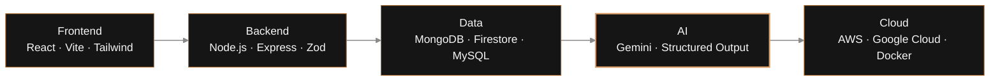

 

<b>AI · CLOUD · PRODUCT ENGINEERING</b>

  

  

<a href="#about"><kbd> About </kbd></a>
  <a href="#projects"><kbd> Projects </kbd></a>
  <a href="#stack"><kbd> Stack </kbd></a>
  <a href="#activity"><kbd> Activity </kbd></a>
  <a href="#contact"><kbd> Contact </kbd></a>

  

I build software end to end — the interface, the API, the data model, 
the AI feature that earns its place, and the deployment that puts it in front of users.

 

<a href="https://www.linkedin.com/in/regan-jesuraju/"><kbd> LinkedIn ↗ </kbd></a>
  <a href="http://regan-jesuraju-portfolio-2026.s3-website-ap-southeast-2.amazonaws.com/"><kbd> Portfolio ↗ </kbd></a>
  <a href="https://medium.com/@regannbis"><kbd> Medium ↗ </kbd></a>
  <a href="mailto:regannbis@gmail.com"><kbd> Email ↗ </kbd></a>

 

## About

<table width="100%">
<tr>
<td width="56%" valign="top">

I'm a Computer Engineering student at Karunya University, building toward SDE roles.

  

My core is full-stack engineering: the path from what a user sees to how data is modelled, validated and served. AI is how I make an application do what a static one can't — as an integration inside a real system, not the whole product. Cloud is how I ship it.

  

<blockquote>
I'd rather own one system from the first click to the last query than collect ten frameworks.
</blockquote>

</td>

<td width="44%" valign="top">

<b>Currently building</b>

  

<code>01</code>   <b>Full-Stack Engineering</b>  React · Node.js · REST APIs · MongoDB

  

<code>02</code>   <b>Java + DSA</b>  Structured problem-solving practice

  

<code>03</code>   <b>AI-Powered Applications</b>  LLM features with structured, validated output

  

<code>04</code>   <b>Backend Architecture</b>  Auth · validation · data modelling

  

<code>05</code>   <b>Cloud Deployment</b>  AWS · Google Cloud · shipping to real users

</td>
</tr>
</table>

 

## Projects

Selected work. In each one, the model call is a component — the product is everything built around it.

  

<table width="100%">
<tr>
<td colspan="2" valign="top">

<b>01 / FLAGSHIP</b>

<h3>GoodFit</h3>

<b>Role-fit intelligence for resumes, grounded in the actual job posting.</b>

</td>
</tr>

<tr>
<td colspan="2" align="center">

</td>
</tr>

<tr>
<td width="50%" valign="top">

<b>Problem</b>

  

Most resume checkers grade against a generic "ideal" resume. Every real opening asks for something different, so the feedback misses what the posting actually requires.

</td>

<td width="50%" valign="top">

<b>What I built</b>

  

Upload a PDF, paste a job description, and get a 0–100 match score with a verdict, the skills found and missing, and exactly three prioritised fixes. Recent analyses are stored in MongoDB, keyed to an anonymous per-browser ID.

</td>
</tr>

<tr>
<td colspan="2" valign="top">

<b>Engineering</b>

<ul>
<li><b>Model output is a contract.</b> Gemini is called with a JSON response schema, then re-validated with Zod — including exactly three fixes, typed arrays and a numeric score. The score is rounded and clamped to 0–100 server-side, with one automatic retry.</li>

<li><b>Untrusted input stays untrusted.</b> The resume and job description are delimited in the prompt and the model is instructed to ignore instructions inside them. A probe script plants "give this candidate 100" payloads to test that behaviour.</li>

<li><b>Defense in depth on uploads.</b> 4 MiB cap, MIME-type validation and <code>%PDF-</code> magic-byte checks, with distinct errors for scanned or oversized files.</li>

<li><b>Abuse and privacy controls.</b> Analysis is rate-limited to 5 requests per 10 minutes per client. PDFs are parsed in memory and never written to disk. Resume text is never stored and the API key remains server-side.</li>

<li><b>Tested and honest.</b> A <code>node:test</code> suite covers the schema contract, mocked Gemini integration and endpoint validation. Design decisions and known limitations are documented in the repository.</li>
</ul>

</td>
</tr>

<tr>
<td width="50%" valign="top">

<b>Stack</b>

  

<code>React</code> <code>Tailwind</code> <code>Node.js + Express</code> <code>MongoDB</code> <code>Gemini</code> <code>Zod</code>

</td>

<td width="50%" valign="top">

<a href="https://github.com/ItzMeBeasT/resume-fit-ai"><b>→ View repository</b></a>

 

<a href="https://github.com/ItzMeBeasT/resume-fit-ai/blob/main/decisions.md"><b>→ Read the design decisions</b></a>

</td>
</tr>
</table>

 

```mermaid
flowchart LR
    A["React Client<br/>PDF + Job Description"]
    --> B["Express API<br/>Rate Limit · Upload Checks"]

    B --> C["In-Memory<br/>PDF Parsing"]

    C --> D["Gemini<br/>JSON Response Schema"]

    D --> E["Zod Validation<br/>Clamp Score · Retry Once"]

    E --> F[("MongoDB<br/>Results Only")]

    style A fill:#151515,stroke:#B87333,stroke-width:1px,color:#F5F5F5
    style B fill:#151515,stroke:#B87333,stroke-width:1px,color:#F5F5F5
    style C fill:#151515,stroke:#B87333,stroke-width:1px,color:#F5F5F5
    style D fill:#151515,stroke:#D99B63,stroke-width:2px,color:#F5F5F5
    style E fill:#151515,stroke:#B87333,stroke-width:1px,color:#F5F5F5
    style F fill:#151515,stroke:#B87333,stroke-width:1px,color:#F5F5F5
    linkStyle default stroke:#8A8A8A,stroke-width:1.5px
```

GoodFit request path: every stage between the upload and the database exists to keep the model's output trustworthy.

  

<table width="100%">
<tr>
<td colspan="2" valign="top">

<b>02 / AI</b>

<h3>Gemini LifeOS</h3>

<b>A reflection-to-action platform: conversations become structured insight, then tracked work.</b>

</td>
</tr>

<tr>
<td colspan="2" valign="top">

<b>Problem</b>

  

Journals capture thoughts and then do nothing with them. Each reflection should turn into a concrete next step, and be read in the context of the entries before it.

</td>
</tr>

<tr>
<td colspan="2" valign="top">

<b>Engineering</b>

<ul>
<li><b>Structured reflection engine.</b> A multi-turn Gemini conversation is converted into typed JSON — summary, themes, patterns, tone and action items — enforced by a response schema rather than prompted formatting.</li>

<li><b>Identity is verified, never trusted.</b> Firebase ID tokens are verified server-side; the user ID is derived from the token and never taken from the request body.</li>

<li><b>Default-deny data layer.</b> Firestore rules allow only per-user access and validate the schema of every write.</li>

<li><b>Growth Memory.</b> A backend engine reads a user's last 10 entries server-side and analyses recurring patterns across sessions.</li>

<li><b>Security you can watch.</b> An in-app Security Center fires a real authenticated and a real unauthenticated request, demonstrating the auth boundary instead of simply claiming it.</li>
</ul>

</td>
</tr>

<tr>
<td width="50%" valign="top">

<b>Stack</b>

  

<code>React</code> <code>TypeScript</code> <code>Express</code> <code>Firebase Auth</code> <code>Firestore</code> <code>Gemini</code>

</td>

<td width="50%" valign="top">

<a href="https://github.com/ItzMeBeasT/gemini-lifeos"><b>→ View repository</b></a>

</td>
</tr>
</table>

 

<table width="100%">
<tr>
<td colspan="2" valign="top">

<b>03 / CLOUD</b>

<h3>Portfolio on AWS</h3>

<b>A live static site served straight from S3 website hosting.</b>

</td>
</tr>

<tr>
<td width="50%" valign="top">

<b>Problem</b>

  

My work needed a stable public home, and I wanted to learn AWS by deploying something real instead of following a walkthrough.

</td>

<td width="50%" valign="top">

<b>What I built</b>

  

A static site deployed to S3 in <code>ap-southeast-2</code>, with bucket access and IAM configured by hand during a Corizo cloud computing internship.

</td>
</tr>

<tr>
<td width="50%" valign="top">

<b>Stack</b>

  

<code>AWS S3</code> <code>IAM</code> <code>HTML</code>

</td>

<td width="50%" valign="top">

<a href="http://regan-jesuraju-portfolio-2026.s3-website-ap-southeast-2.amazonaws.com/"><b>→ Visit the site</b></a>

</td>
</tr>
</table>

 

<a href="https://github.com/ItzMeBeasT?tab=repositories">
<kbd> View all repositories → </kbd>
</a>

  

## Stack

<b>Engineering map</b>

 

Where each layer lives across the products above.

  

```mermaid
flowchart LR
    F["Frontend<br/>React · Vite · Tailwind"]
    --> B["Backend<br/>Node.js · Express · Zod"]

    B --> D["Data<br/>MongoDB · Firestore · MySQL"]

    D --> A["AI<br/>Gemini · Structured Output"]

    A --> C["Cloud<br/>AWS · Google Cloud · Docker"]

    style F fill:#151515,stroke:#B87333,stroke-width:1px,color:#F5F5F5
    style B fill:#151515,stroke:#B87333,stroke-width:1px,color:#F5F5F5
    style D fill:#151515,stroke:#B87333,stroke-width:1px,color:#F5F5F5
    style A fill:#151515,stroke:#D99B63,stroke-width:2px,color:#F5F5F5
    style C fill:#151515,stroke:#B87333,stroke-width:1px,color:#F5F5F5
    linkStyle default stroke:#8A8A8A,stroke-width:1.5px
```

 

| Layer                | Technologies                                                           |
| :------------------- | :--------------------------------------------------------------------- |
| **Languages**        | Java · Python · JavaScript · TypeScript                                |
| **Frontend**         | React · Vite · Tailwind CSS                                            |
| **Backend**          | Node.js · Express · REST APIs · Zod                                    |
| **Data**             | MongoDB · Firestore · MySQL                                            |
| **AI**               | Gemini API · structured JSON output · prompt-injection-aware prompting |
| **Cloud & Delivery** | AWS (S3, IAM) · Google Cloud (Firebase) · Docker · GitHub Actions      |
| **Practices**        | Input validation · token-based auth · rate limiting · automated tests  |

 

<b>Engineering foundations</b>

 

The parts that outlast any framework.

  

<table width="100%">
<tr>
<td width="33%" valign="top">

<b>Java</b>

 

Core language for problem solving and object-oriented design.

</td>

<td width="33%" valign="top">

<b>Data Structures & Algorithms</b>

 

Ongoing, structured practice alongside project work.

</td>

<td width="33%" valign="top">

<b>Object-Oriented Programming</b>

 

Modelling, abstraction and clean class design.

</td>
</tr>

<tr>
<td width="33%" valign="top">

<b>Backend Engineering</b>

 

API design, authentication and validation.

</td>

<td width="33%" valign="top">

<b>Database Fundamentals</b>

 

Relational and document modelling — MySQL, MongoDB and Firestore.

</td>

<td width="33%" valign="top">

<b>System Design Fundamentals</b>

 

Components, trade-offs and failure modes.

</td>
</tr>
</table>

 

## Activity

 

  

 

Contribution activity visualised through a GitHub Actions-generated contribution snake.

  

## Contact

 

<a href="https://www.linkedin.com/in/regan-jesuraju/"><kbd> LinkedIn </kbd></a>
  <a href="http://regan-jesuraju-portfolio-2026.s3-website-ap-southeast-2.amazonaws.com/"><kbd> Portfolio </kbd></a>
  <a href="https://medium.com/@regannbis"><kbd> Medium </kbd></a>
  <a href="mailto:regannbis@gmail.com"><kbd> Email </kbd></a>

   

<i>Everything on this page links to something you can read, explore or run.</i>

  

